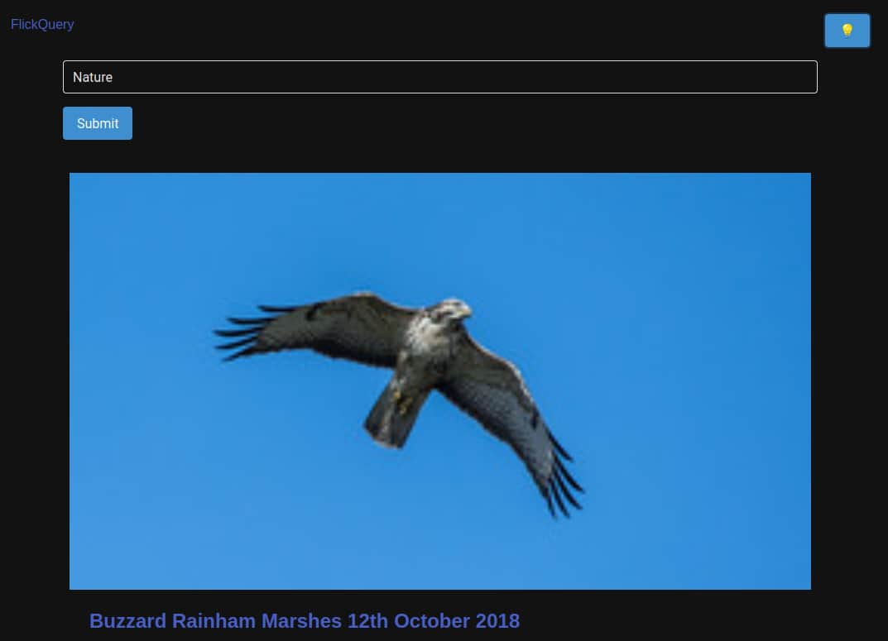

<div align = "center">

<h1><a href="https://2kabhishek.github.io/flick-query">Flick Query</a></h1>

<a href="https://github.com/2KAbhishek/Flick Query/blob/main/LICENSE">
 </a>

<a href="https://github.com/2KAbhishek/Flick Query/graphs/contributors">
 </a>

<a href="https://github.com/2KAbhishek/Flick Query/stargazers">
</a>

<a href="https://github.com/2KAbhishek/Flick Query/network/members">
 </a>

<a href="https://github.com/2KAbhishek/Flick Query/watchers">
 </a>

<a href="https://github.com/2KAbhishek/Flick Query/pulse">
 </a>

<h3>Minimalist Flickr Frontend 🖼️🔍</h3>

<figure>
  
  <br/>
  <figcaption>flick-query screenshot</figcaption>
</figure>

</div>

## What is this

flick-query is a web app that allows you to search images from Flickr.

## Inspiration

Needed a lighter and cleaner alternative to flickr, found their API.

## Prerequisites

Before you begin, ensure you have met the following requirements:

- You have installed the latest version of `any modern browser`

## Getting flick-query

To get flick-query, follow these steps:

```bash
git clone https://github.com/2kabhishek/flick-query
cd flick-query
```

## Viewing flick-query

Open `index.html` in your favorite browser or visit [2kabhishek.github.io/flick-query](https://2kabhishek.github.io/flick-query).

## How it was built

flick-query was built using `VS Code`, `Bulma CSS`, `HTML`, `CSS` & `JavaScript`.

## Challenges faced

- Fetching image data with plain JS was tricky.

## What I learned

- AJAX with Vanilla JS.
- Flickr API
- Dark mode toggle using Vanilla JS and CSS.

Hit the ⭐ button if you found this useful.

## More Info

<div align="center">

<a href="https://github.com/2KAbhishek/flick-query">Source</a> | <a href="https://2kabhishek.github.io/flick-query">Website</a>

</div>
